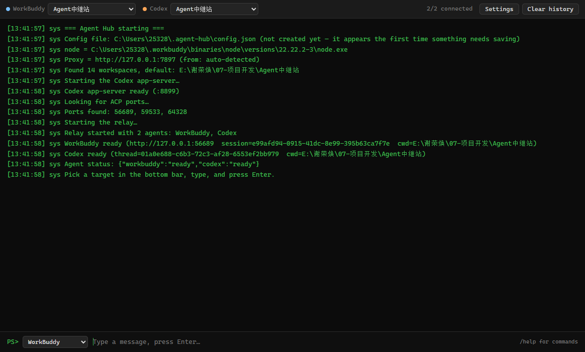
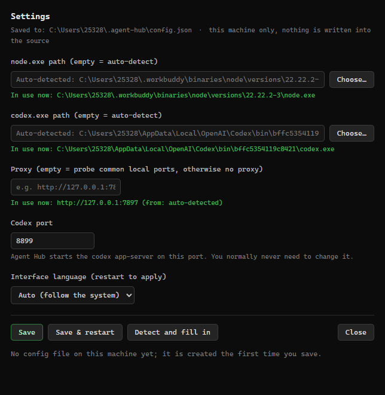

# Agent Hub

Run several AI agents side by side in one window. Terminal-style UI, built with Electron.
Windows only for now.

[中文](README.md) · [English](README.en.md)



## What it's for

If you keep WorkBuddy and Codex open at the same time, you know the annoyance: each one works in
its own bubble, and moving a result from one to the other means copy-paste and a lot of window
switching.

Agent Hub sits in the middle. Every agent gets its own long-lived connection, none of them know
the others exist, and all routing happens in the hub. You pick who to send to from the same
window, and their replies stream into one timeline, colour-coded per agent.

```
WorkBuddy  ←— ACP (HTTP + SSE) ——┐
                                 ├——  Agent Hub  ——→  one terminal window
Codex      ←— WebSocket + RPC ——┘
```

The top bar has a status light and a workspace picker for each agent, so an agent can point at
its own directory. The bottom bar is where you choose a target, type, and press Enter. History is
kept, with a button to clear it.

## Install

**Use the exe** — grab `AgentHub.exe` from
[Releases](https://github.com/xieronghuan/agent-hub/releases/latest). It's portable: no install,
just double-click.

**From source**:

```bash
git clone https://github.com/xieronghuan/agent-hub.git
cd agent-hub/app
npm install
npm start
```

`启动AgentHub.cmd` is a launcher for the source version; it has nothing to do with the exe.

You need Windows, plus at least one of WorkBuddy or Codex installed.

If it can't find `codex.exe` on first launch, click Settings in the top right and point it at the
file. No docs needed.

The interface is bilingual: it follows your system language, and you can pin it to Chinese or
English in Settings.

## Usage

Pick who you're sending to from the dropdown at the bottom left, type, and press Enter. Choose
**Everyone** and one message goes to every agent at once.

A few commands you can type straight into the input box:

- `/ws` — list workspaces
- `/ws <index|path>` — switch the current target's workspace
- `/t <agentId>` — change the default target in the bottom bar
- `/status` — show each agent's status
- `/clear` — clear the screen
- `/help` — show help

## Configuration

Paths, proxy, ports — none of that is the same on two machines, so none of it is hardcoded.
Everything is looked up in the same order:

```
env var → ~/.agent-hub/config.json → auto-detect → open the Settings window and ask you
```

Click Settings in the UI to edit it:



| Setting | Env var | Notes |
|---|---|---|
| node.exe path | `WB_NODE` | auto-detected if empty |
| codex.exe path | `CODEX_CLI` | auto-detected if empty; ignore it if you don't use Codex |
| Proxy | `RELAY_PROXY` | if empty, probes common local proxy ports (7897 / 7890 / 10809 / 1080 …). Reaching Codex from mainland China usually needs a proxy |
| Codex port | — | defaults to `8899` |
| Interface language | `RELAY_LANG` | empty follows the system; set `zh` or `en` to pin it |

Config stays on your machine; it doesn't travel with the repo. Everything lives in
`~/.agent-hub/`:

| File | What it is |
|---|---|
| `config.json` | the settings above |
| `relay.jsonl` | message archive |
| `relay.log` | runtime log — look here first when something breaks |
| `<agentId>-app.log` | output from each agent's own server |

## Adding another agent

The whole thing is config-driven: the hub and the UI both render from the list. Adding an agent
doesn't require touching `relay-server.js` or the UI code.

Put it in the `agents` array of `~/.agent-hub/config.json`. If you'd rather not edit that file,
you can edit `app/agents.js` in the source instead — same structure.

Fields per agent:

| Field | Required | Notes |
|---|---|---|
| `id` | yes | unique id, used by the UI, commands and logs |
| `name` | | display name |
| `color` | | this agent's colour — used for both the dot in the top bar and its messages |
| `kind` | yes | how it connects, see below |
| `enabled` | | `false` disables this agent |

Supported `kind`s:

| kind | For | Extra fields |
|---|---|---|
| `acp` | anything speaking ACP over HTTP + SSE, like WorkBuddy | `autoDiscover: true` (discover the port at runtime), or `base: "http://127.0.0.1:xxxx"` |
| `codex-app-server` | Codex (WebSocket + JSON-RPC) | `port` (default 8899), `proxy` (usually empty — the global proxy applies) |
| `openai-compatible` | reserved for any OpenAI-compatible HTTP endpoint | — |

The current config looks like this — two agents:

```json
{
  "agents": [
    { "id": "workbuddy", "name": "WorkBuddy", "color": "#79c0ff",
      "kind": "acp", "autoDiscover": true },
    { "id": "codex", "name": "Codex", "color": "#ffa657",
      "kind": "codex-app-server", "port": 8899 }
  ]
}
```

For a completely different kind of agent: `app/workbuddy-link.js` (the HTTP + SSE one) and
`app/relay.js` (the WebSocket + JSON-RPC one) are two working references. Write a new link that
lets the hub

- `connect()` / `init()`
- open a session (with a workspace `cwd`)
- send one message via `say()` or `prompt()`
- emit streaming text through the `delta` event

then register the new `kind` in `_makeLink()` inside `relay-server.js`. The two references expose
symmetric interfaces, so either one is a fine template.

## Known annoyances

**Double-clicking the exe does nothing** — check your antivirus first; unsigned exes get blocked
a lot. The runtime log is at `~/.agent-hub/relay.log`.

**I asked them to "talk to each other" and only one answered** — the agents cannot see each other,
and that is deliberate: all routing lives in the hub, so each agent believes it is simply talking
to you. Picking "Everyone" delivers one message to all of them, but they still answer separately
and never see each other's replies.

To actually get them exchanging content, you carry it across: paste one agent's reply into the
other. Each agent is told once, on its first message, who else is on the hub — so it no longer
guesses (and stops inventing a subagent to play the other party).

**Codex never connects, or a message produces nothing** — it's almost always the proxy. Fill it in
under Settings. Startup probes common ports once, but you may have to type it in yourself.

**WorkBuddy won't connect** — make sure WorkBuddy is actually running. Its ACP port changes on
every start; the hub discovers it, so you normally don't have to do anything.

**Codex says "already open in another app"** — Codex allows only one writer per conversation.
While Agent Hub is running, it holds the conversation for that directory. To go back to the Codex
client, close Agent Hub first (or point its workspace somewhere else).

**The exe is 100 MB** — that's Electron. What you get in return is no runtime to install. Fair
warning, so the download isn't a surprise.

## Development

```bash
cd app
npm install
npm start        # run from source
npm run pack     # build dist/AgentHub.exe
```

A few manual test scripts live in the repo root. Start the corresponding service first:

```bash
node test-workbuddy-link.js    # the WorkBuddy link
node test-codex-link.js        # the Codex link
node test-relay.js             # one message to each agent, end to end
node debug-acp.js              # dump raw ACP traffic
```

The default workspace is the current directory; override with `RELAY_CWD=<path>`.

`codex-schema/` (Codex's protocol definitions, ~3.9 MB) is not in the repo. Generate it yourself:

```bash
codex app-server generate-json-schema --out codex-schema
```

## License

[PolyForm Noncommercial 1.0.0](LICENSE).

In short: personal use, study, research, experiments, hobbies, and charitable / educational /
public research / government use are all fine. Selling it, shipping it in a commercial product,
or using it commercially inside a company requires a separate license from me.

For commercial licensing, reach out on GitHub: [@xieronghuan](https://github.com/xieronghuan).

WorkBuddy and Codex are names and trademarks of their respective owners. This project is not
affiliated with them.
