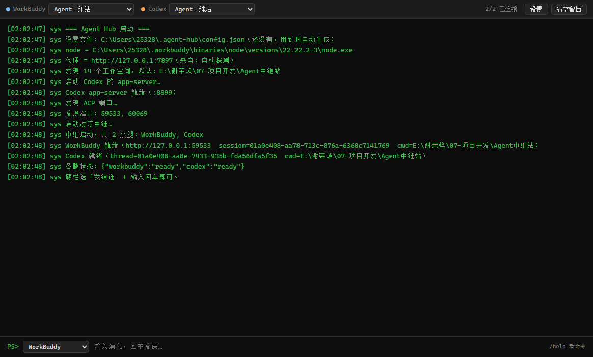
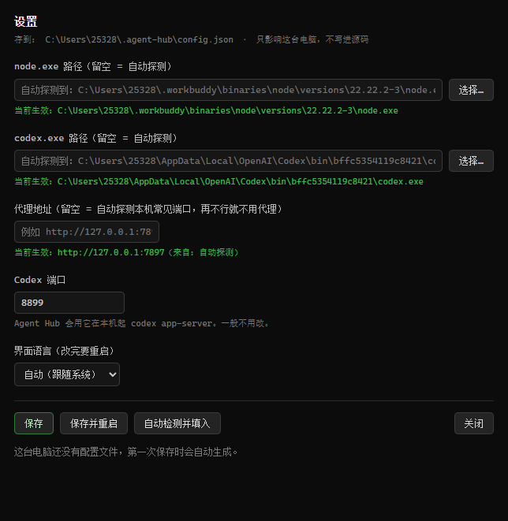

# Agent Hub

把多个 AI agent 放在一个窗口里用。终端界面，Electron 写的，目前只在 Windows 上跑过。

[中文](README.md) · [English](README.en.md)



## 这是干嘛的

同时开着 WorkBuddy 和 Codex 的时候，麻烦在于两边各干各的：想把一边的结果丢给另一边，
只能手动复制粘贴、来回切窗口。

所以中间做了个中继。每个 agent 各接一条长连接，彼此不知道有对方，路由都在中继里。
你在同一个窗口里选「发给谁」，各家的回复按颜色区分，混在一条时间线上。

```
WorkBuddy  ←— ACP (HTTP + SSE) ——┐
                                 ├——  Agent Hub  ——→  一个终端窗口
Codex      ←— WebSocket + RPC ——┘
```

顶栏每个 agent 一组「状态灯 + 工作空间下拉」，各自可以指定不同的目录；底栏选目标、打字、回车。
历史会记下来，界面上有按钮清空。

## 装

**用 exe**：到 [Releases](https://github.com/xieronghuan/agent-hub/releases/latest) 下 `AgentHub.exe`，
免安装，双击就跑。

**从源码**：

```bash
git clone https://github.com/xieronghuan/agent-hub.git
cd agent-hub/app
npm install
npm start
```

`启动AgentHub.cmd` 是给源码版用的启动脚本，和 exe 没关系。

需要 Windows，另外 WorkBuddy 和 Codex 至少得装一个。

第一次打开如果提示找不到 `codex.exe`，点右上角「设置」指一下位置就行，不用翻文档。

## 用法

底栏左边选发给谁，输入内容，回车。选「**所有人**」的话，一条消息会同时发给所有 agent，
**并开启自动接力**（见下）。

界面中英文都支持，默认跟随系统语言，想固定就去「设置」里改。

### 用哪个模型、多想想

顶栏每个 agent 名字旁边有两个下拉：模型，和思考强度。都能直接换，不用重启。

- WorkBuddy：模型 20 个（就是客户端里那些：快速 / 均衡 / 极致 / GLM / Kimi / Deepseek……），
  强度 7 档（最省 / 低 / 中 / 高 / 极高 / 最高 / 跟随模型默认）。**换完立刻生效**
- Codex：模型 5 个（GPT-6-Astra / GPT-5.6-Sol / Terra / Luna / GPT-5.5），
  强度 6 档（低 / 中 / 高 / 极高 / 最高 / Ultra）。**下一轮生效** ——
  Codex 的模型和强度都是按轮传的，所以换完不用重开会话，上下文照样在

启动日志里会把各自的当前模型和强度打出来。

> 注意：WorkBuddy 那边是改在**你那条会话**上的（中继借用客户端正在用的会话），
> 所以在这里换了模型，WorkBuddy 客户端里也会跟着变。

### 让它们互相聊

**自动接力默认开着，而且不限轮数。** 你发一条消息给谁，谁答完之后，它的回复就**自动转给另一个
agent**，对方接着回，就这样一直往下走 —— 不用你守在旁边。

- 转过去的消息带 `[中继·来自 xxx]` 前缀，对方知道这是谁说的
- **谈完了就回 `[完]`** —— 中继会停止转达（这是让它们自己收尾的主要手段）
- 输入 `/stop` 随时打断；再发一条消息会重新开始
- 不想用：`~/.agent-hub/config.json` 里 `autoRelay` 设成 `false`。想给它加个上限，
  就把 `autoRelayMaxHops` 设成正数（默认 `0`，也就是不限）

> 为什么要有「回 `[完]`」这一条：**实测过，完全不设限时两个 agent 会一直互相发
> "收到""待命""无需转发"这类空话**（90 秒空转 25 轮）。靠长度或关键词猜"有没有实质内容"
> 很容易误杀正常对话，所以给它们一个明确的结束方式。除此之外还有两层兜底：
> 某条腿这一轮和上一轮一字不差（判定在原地打转）也停。

另外有几个命令，在输入框里直接打：

- `/ws` — 列出工作空间
- `/ws <编号|路径>` — 切换当前默认目标的工作空间
- `/t <agentId>` — 切换底栏默认发给谁
- `/status` — 看各 agent 状态
- `/clear` — 清屏
- `/help` — 看帮助

## 配置

路径、代理、端口这些，每台电脑都不一样，所以都没写死在代码里。一律按这个顺序找：

```
环境变量 → ~/.agent-hub/config.json → 自动探测 → 弹设置窗口让你填
```

界面上点「设置」就能改：



| 项 | 环境变量 | 说明 |
|---|---|---|
| node.exe 路径 | `WB_NODE` | 留空则自动探测 |
| codex.exe 路径 | `CODEX_CLI` | 留空则自动探测；不装 Codex 可以不管 |
| 代理地址 | `RELAY_PROXY` | 留空则自动探测本机常见代理端口（7897 / 7890 / 10809 / 1080 …）。在大陆访问 Codex 一般都要代理 |
| Codex 端口 | — | 默认 `8899` |
| 界面语言 | `RELAY_LANG` | 留空跟随系统；想固定就填 `zh` 或 `en` |

界面语言在「设置」里也能改（自动 / 中文 / English），改完重启生效。

### 对话落在哪（会话归属）

**两条腿都会接进"这个目录已有的那条对话"**，不会每开一次程序就新开一条：

- **WorkBuddy** —— 接进它客户端里这个目录正在用的那条会话，所以中继收发的内容在你 WorkBuddy
  窗口里看得见、也能接着聊

  ⚠️ 但**它干活的目录是 WorkBuddy 客户端说了算的**：ACP 入口跟着「你在 WorkBuddy 里当前打开的
  那个项目」走，中继这边给它选的工作空间**管不住它**。想让它在中继站这个目录里干活，先在
  WorkBuddy 客户端里切到那个目录。没切的话，中继会打一行警告说明入口实际属于哪儿 ——
  那种情况下借用会话是借不到的，它只能让主机新建一条（那条不会出现在客户端列表里）。
- **Codex** —— 先问一遍这个目录最近用过哪条 thread（`thread/list`），再接上去（`thread/resume`）。
  所以 Codex 客户端里不会每开一次程序就多出一条对话

为什么这么绕：ACP 自己新建的会话**不会出现在 WorkBuddy 客户端列表里**（客户端那份列表读的是
本地的一个库），那样发出去的东西你在客户端里就找不到。Codex 也是同一类问题 —— 新建的 thread
虽然落在 `~/.codex/sessions/` 里、能用 `codex resume <threadId>` 打开，但客户端侧边栏不一定列出来。

- 该目录还没有对话时，才会新建一条
- 不想接已有的对话、每次都要全新的：`~/.agent-hub/config.json` 里 `borrowClientSession` 设为 `false`

配置只存在本机，不跟着仓库走。相关文件都在 `~/.agent-hub/`：

| 文件 | 是什么 |
|---|---|
| `config.json` | 上面那些设置 |
| `relay.jsonl` | 消息留档 |
| `relay.log` | 运行日志，出问题先看它 |
| `<agentId>-app.log` | 各 agent 自带服务端的输出 |

## 接新的 agent

整个东西是配置驱动的，中继和界面都照着一份清单来。加一个 agent 不用碰 `relay-server.js`，
也不用碰界面代码。

配置写在 `~/.agent-hub/config.json` 的 `agents` 数组里。不想动配置文件的话，直接改源码里的
`app/agents.js` 也行，两边结构一样。

每个 agent 的字段：

| 字段 | 必填 | 说明 |
|---|---|---|
| `id` | 是 | 唯一标识，界面、命令、日志都用它 |
| `name` | | 显示名 |
| `color` | | 这个 agent 的标识色，顶栏圆点和消息正文都用它，两边对应 |
| `kind` | 是 | 接入方式，见下表 |
| `enabled` | | 填 `false` 就不启用这个 agent |

`kind` 目前支持三种：

| kind | 是什么 | 专用字段 |
|---|---|---|
| `acp` | WorkBuddy 这类 ACP over HTTP + SSE | `autoDiscover: true`（端口动态发现），或者 `base: "http://127.0.0.1:xxxx"` |
| `codex-app-server` | Codex，WebSocket + JSON-RPC | `port`（默认 8899）、`proxy`（一般留空，走全局代理设置） |
| `openai-compatible` | 预留，任何 OpenAI 兼容的 HTTP 端点 | — |

现在这份配置长这样，接了两个 agent：

```json
{
  "agents": [
    { "id": "workbuddy", "name": "WorkBuddy", "color": "#79c0ff",
      "kind": "acp", "autoDiscover": true },
    { "id": "codex", "name": "Codex", "color": "#ffa657",
      "kind": "codex-app-server", "port": 8899 }
  ]
}
```

要接一个完全不同的 agent 的话：`app/workbuddy-link.js`（HTTP + SSE 那个）和 `app/relay.js`
（WebSocket + JSON-RPC 那个）就是两个参考实现。照着自己写一个 link，让中继能

- `connect()` / `init()`
- 建会话（带上工作空间 `cwd`）
- 用 `say()` 或 `prompt()` 发一句话
- 把流式正文通过 `delta` 事件吐出来

然后在 `relay-server.js` 的 `_makeLink()` 里把新的 `kind` 挂上。两个参考实现的对外接口是对称的，
抄哪个都行。

## 几个坑

**双击 exe 没反应** —— 先看杀毒软件，没签名的 exe 经常被拦。运行日志在 `~/.agent-hub/relay.log`。

**发一句「你俩聊两句」，为什么只有一个回话** —— agent 之间**互相看不见**，路由都在中继里，
每个 agent 只知道自己在跟你说话。所以你要靠**自动接力**替它们传话：某条腿答完，它的回复会
自动转给另一个，对方就真的接上话了。不限轮数，觉得没什么可接的就回 `[完]`，接力就停。

**Codex 那边每开一次程序就多一条对话** —— 以前是每次启动都新建 thread。现在会先找这个目录
最近用过的那条接上（见上面「对话落在哪」）。日志里会写「Codex 接着用原来的对话（xxx）」。

每个 agent 在**第一次**收到消息时，会被告知"这张桌子上还接着谁"，所以它不会再瞎猜
（不会再把"你俩"理解成自己拉个子代理）。

**Codex 一直连不上，或者发消息后不出字** —— 基本都是代理。点「设置」把代理地址填上。
启动时会自动探一次常见端口，探不出来就得手填。

**WorkBuddy 连不上** —— 确认 WorkBuddy 在运行。它的 ACP 端口每次启动都会变，中继是动态发现的，
一般不用管。

**Codex 里提示「已在另一个应用中打开」** —— Codex 对每个会话只允许一个写入者。
在 Agent Hub 开着的时候，它就占着那个目录的会话。想回 Codex 客户端继续，
先把 Agent Hub 关掉（或把它的工作空间换到别处）。

> 端口这块说一下：Agent Hub 会在 8899 起自己的 codex 后端，但**只清自己起的那个**。
> 如果端口上已经是别人的进程（比如你 Codex 客户端自己起的），它会直接用、不碰它，
> 关掉 Agent Hub 也不会把它带走。到底是哪种情况，启动日志里会写明。

**exe 一百兆** —— Electron 就这样，换来的是不用装运行时。先说一声，免得下载的时候惊讶。

## 开发

```bash
cd app
npm install
npm start        # 源码运行
npm run pack     # 打包，出 dist/AgentHub.exe
```

根目录还有几个手动测试脚本，跑之前先把对应的服务跑起来：

```bash
node test-workbuddy-link.js    # 测 WorkBuddy 这条线
node test-codex-link.js        # 测 Codex 这条线
node test-relay.js             # 两个 agent 各发一句，端到端
node debug-acp.js              # 打原始报文，排查用
```

默认工作空间取当前目录，可以用 `RELAY_CWD=<路径>` 换掉。

`codex-schema/`（Codex 的协议定义，约 3.9MB）没进仓库，需要的话自己生成：

```bash
codex app-server generate-json-schema --out codex-schema
```

## 许可证

[PolyForm Noncommercial 1.0.0](LICENSE)。

简单说：个人使用、学习、研究、实验、业余爱好，以及慈善 / 教育 / 公共科研 / 政府机构，随便用。
拿去卖、做成商业产品，或者在公司里当商业用途，得先找我拿授权。

商用授权联系 GitHub [@xieronghuan](https://github.com/xieronghuan)。

WorkBuddy、Codex 这些名字和商标归各自所有者，这个项目和它们没有隶属关系。
